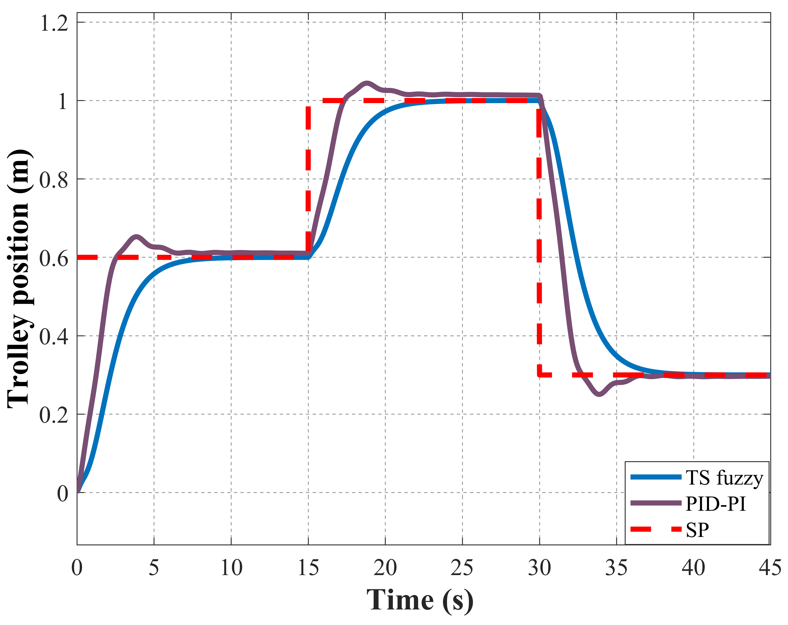
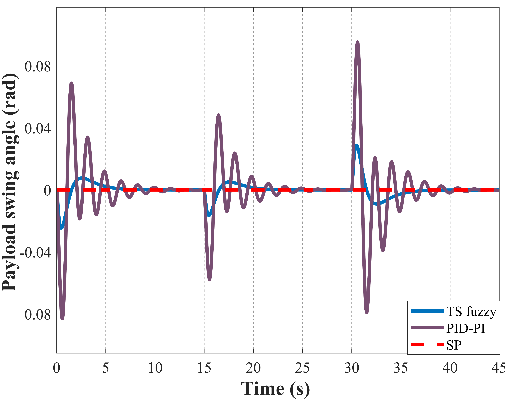
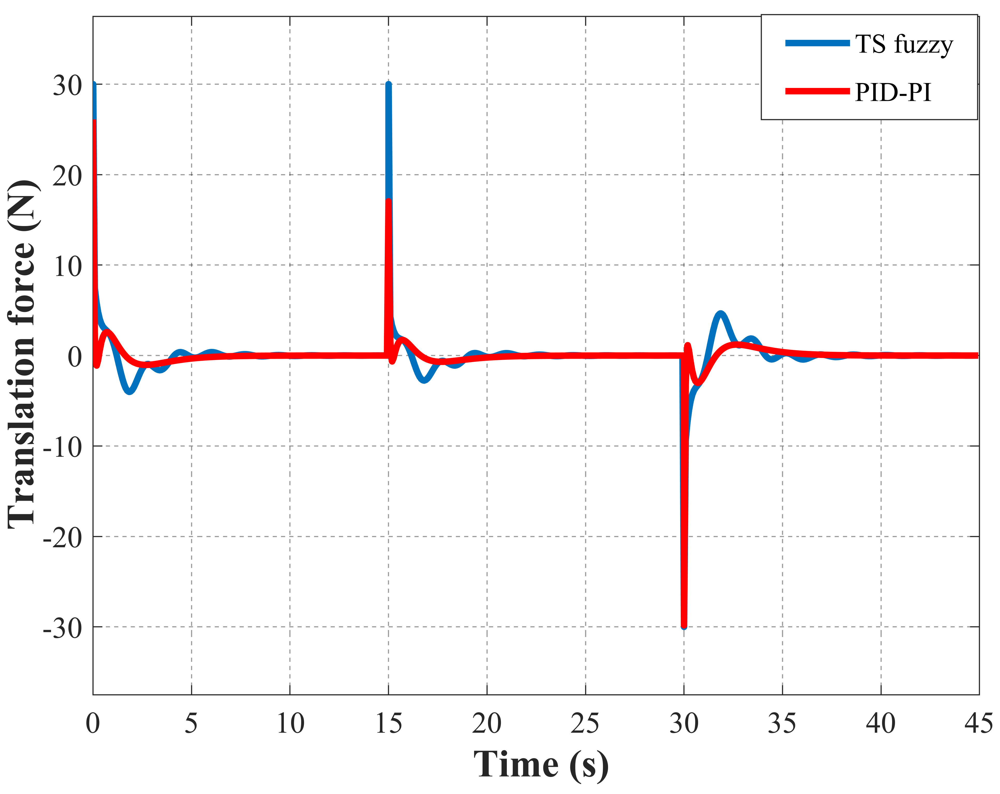

# tower_crane_ts_fuzzy_matlab

## Introduction

This repository contains all the essential files required for the implementation of the Takagi-Sugeno Fuzzy controller for reference tracking of a tower crane system, as presented in our paper ["Takagi-Sugeno Fuzzy Approach with Compressed Representation for Overhead Crane System"](https://ojs.hust.edu.vn/SendArticle/DownLoadArticle.aspx?ID=sJln8CWswJlgdRhlBArr28iAFVXSH1iZMXxNOiuMARFQ8DEtKZodph0mPviUP%3DO0L/yMwdsvnFK8gB/ezrDC5Ug7F8bGBwzAiCxe/6%3Dq8oKA6Xud5kUCxUoCIYp/rRSHBLpW3EuwTgLll7HWi6/uP%3DrKCWYOTc76vj1GzEEjEn%3D3OHBaVdbxKGZ35gjtnbTj). The implementation of the controller is done using MATLAB/Simulink. 

## Results

